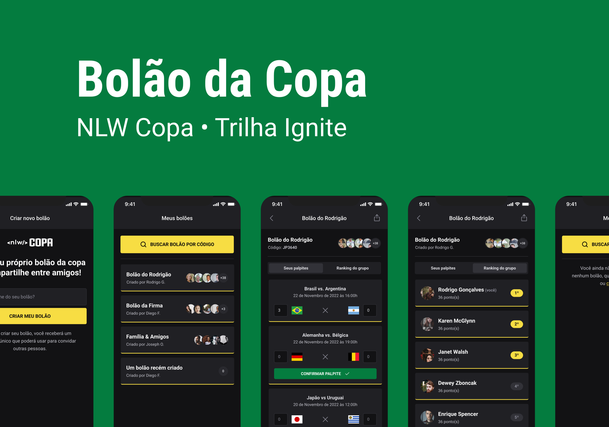

  

  <a href='#about'>📖 Sobre</a>&nbsp;&nbsp;&nbsp;|&nbsp;&nbsp;&nbsp;
  <a href="#design">🎨 Design</a>&nbsp;&nbsp;&nbsp;|&nbsp;&nbsp;&nbsp;
  <a href='#technologies'>🔩 Tecnologias</a>&nbsp;&nbsp;&nbsp;|&nbsp;&nbsp;&nbsp;
  <a href='#challenges'>🚀 Desafios</a>

 

  

# 📖 Sobre o Projeto

O **NLW Copa** é uma aplicação mobile e web desenvolvida durante a copa do mundo de 2022, focada na criação de bolões para os jogos.

# 🎨 Design

O design da aplicação está disponivel no Figma, caso tenha interesse, clique [**aqui**](https://www.figma.com/file/AiMJtzGtp1yj9EqMmYw3hP/nlw-copa?t=Ej9nWkPeB3CZsjmf-6).

# 🔩 Tecnologias

Estas foram as principais tecnologias utilizadas no desenvolvimento da aplicação.

- [ReactJS](https://pt-br.reactjs.org/)
- [React Native](https://reactnative.dev/)
- [Expo](https://docs.expo.dev/)
- [NextJS](https://nextjs.org/)
- [TypeScript](https://www.typescriptlang.org/)
- [Tailwind CSS](https://tailwindcss.com/)
- [Native Base](https://nativebase.io/)
- [Fastify](https://www.fastify.io/)
- [Prisma](https://www.prisma.io/)
- [Zod](https://zod.dev/)

# 🚀 Desafios

Funcionalidades extras adicionadas na aplicação, além de alguns ajustes.

- [ ] Ranking de usuários que mais acertaram palpites
